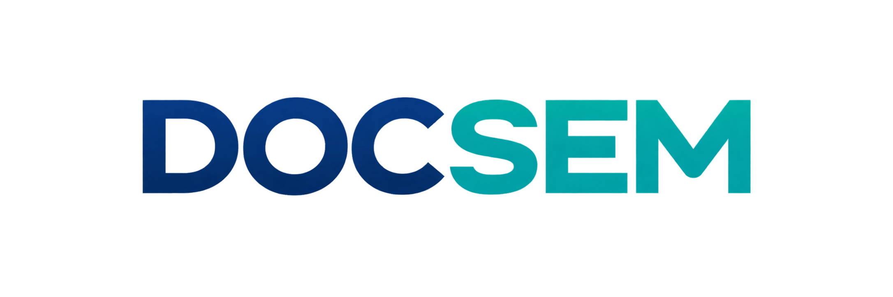

# DOCSEM



**A Python toolkit for extracting document content and building a structured, layout-aware Document Intermediate Representation (DocumentIR).**

[](https://pypi.org/project/docsem/)
[](https://pypi.org/project/docsem/)
[](https://github.com/Shashwat-6012/docsem/blob/main/LICENSE)

DOCSEM (distributed as `docsem`) turns a document file into normalized text and table extraction results, then adds document-level nodes, reading order, and table analysis. It is designed to give downstream applications a consistent Python object model instead of binding their logic directly to one extraction provider's response format.

> **Release status:** Alpha (`0.1.0`). APIs and behavior may change between releases. Review the limitations below before adopting DOCSEM in a production pipeline.

## What it does

DOCSEM runs a two-stage pipeline:

1. **Extract** text blocks and tables from a file using a configured provider.
2. **Build DocumentIR** from the extraction result, assigning page-aware nodes and reading order and running table analysis.

```text
PDF or image file
        │
        ▼
  Text / OCR / layout extraction
        │
        ▼
 ExtractionResult ── blocks, tables, page metadata, warnings
        │
        ▼
     DocumentIR ── nodes, reading order, table relations
        │
        ▼
 Your search, review, analytics, or document-processing application
```

### Current capabilities

- Azure AI Document Intelligence extraction.
- Local PaddleOCR PP-StructureV3 extraction (optional install extra).
- A provider-neutral extraction result containing text blocks, tables, normalized bounding boxes, warnings, page count, and provider metadata.
- Document nodes that point back to extracted blocks and tables.
- Best-effort spatial reading order, including heuristic multi-column ordering.
- Table structure checks and repairs, with an audit record in table metadata.
- LLM-assisted detection of likely table continuations across pages.
- Convenient filters and lookup helpers for nodes, relations, blocks, and tables.

DOCSEM does **not** currently expose the broader semantic-section, document-classification, generic chunking, or duplicate-detection features described in some design material. The current default DocumentIR pipeline focuses on reading order and table analysis.

## Requirements

- Python **3.12 or 3.13** (`>=3.12,<3.14`)
- A supported extraction provider and its credentials/resources
- A Gemini API key for the current default table-analysis pipeline

DOCSEM's default installation includes the Azure and Gemini Python clients. PaddleOCR and llama.cpp are optional dependencies.

**Important:** `DocSem()` with no configuration selects PaddleOCR, which is an optional dependency. With a standard `pip install docsem`, explicitly select Azure as shown below, or install `docsem[paddle]` before using the default configuration. The DocumentIR builder also initializes Gemini-backed table analyzers.

## Installation

Install the published package from PyPI:

```bash
python -m pip install docsem
```

To use local PaddleOCR extraction, install the `paddle` extra:

```bash
python -m pip install "docsem[paddle]"
```

The `llama` extra installs llama.cpp and Hugging Face Hub for integrations that use the local LLM provider directly:

```bash
python -m pip install "docsem[llama]"
```

Install all optional dependencies with:

```bash
python -m pip install "docsem[all]"
```

The `all` extra can include large machine-learning dependencies and may require provider-specific system setup. The default DOCSEM DocumentIR builder currently creates its Gemini provider internally; installing the `llama` extra alone does not switch that pipeline to a local model.

## Quick start: Azure extraction

The following example uses Azure AI Document Intelligence for extraction and the default Gemini-backed table analysis. Supply credentials through environment variables; do not put API keys in source code.

Set the environment variables in your shell:

```bash
# macOS / Linux
export AZURE_ENDPOINT="https://<your-resource>.cognitiveservices.azure.com/"
export AZURE_API_KEY="<your-azure-key>"
export GEMINI_API_KEY="<your-gemini-key>"
```

```powershell
# Windows PowerShell
$env:AZURE_ENDPOINT = "https://<your-resource>.cognitiveservices.azure.com/"
$env:AZURE_API_KEY = "<your-azure-key>"
$env:GEMINI_API_KEY = "<your-gemini-key>"
```

Then process a file:

```python
import os
from pathlib import Path

from docsem.api import DocSem
from docsem.config import DocSemConfig, ExtractorConfig, ProviderName

config = DocSemConfig(
    extraction=ExtractorConfig(
        provider=ProviderName.AZURE,
        options={
            "endpoint": os.environ["AZURE_ENDPOINT"],
            "api_key": os.environ["AZURE_API_KEY"],
            # Optional; defaults to "prebuilt-document".
            "model_id": "prebuilt-document",
        },
    )
)

docsem = DocSem(config=config)
document = docsem.process(Path("invoice.pdf"))

print(f"Provider: {document.source.provider}")
print(f"Pages: {document.source.page_count}")
print(f"Extracted blocks: {len(document.source.blocks)}")
print(f"Extracted tables: {len(document.source.tables)}")
print(f"DocumentIR nodes: {len(document.nodes)}")
```

The SDK does not automatically load a `.env` file. If you use one, load it explicitly in your application:

```python
from dotenv import load_dotenv

load_dotenv()
```

## Quick start: local PaddleOCR extraction

After installing `docsem[paddle]`, select the PaddleOCR provider explicitly:

```python
from pathlib import Path

from docsem.api import DocSem
from docsem.config import DocSemConfig, ExtractorConfig, ProviderName

config = DocSemConfig(
    extraction=ExtractorConfig(
        provider=ProviderName.PADDLEOCR,
        options={
            "lang": "en",
            "use_gpu": False,
        },
    )
)

document = DocSem(config=config).process(Path("scanned-document.pdf"))
```

PaddleOCR performs local extraction; DOCSEM's default table-analysis stage still uses Gemini. Configure `GEMINI_API_KEY` if that stage needs to make a model request (for example, when a table needs repair or possible cross-page continuation is found).

## Working with the result

The returned `DocumentIR` contains the original extraction result and derived nodes and relations. Its `source` keeps provider output in the common extraction model.

```python
# Read text-like blocks and tables from extraction.
for block in document.source.blocks:
    print(block.type, block.content, block.bbox)

for table in document.source.tables:
    print("Header:", [[cell.content for cell in row] for row in table.header])
    for row in table.rows:
        print([cell.content for cell in row])

# Nodes are ordered by document reading order and point to the raw block/table.
for node in document.reading_order():
    raw_item = document.resolve(node)
    print(node.id, node.kind, node.page, node.order_index, raw_item)

# Review table continuation relations.
for relation in document.relations.continuations():
    print(
        relation.source_id,
        "continues as",
        relation.target_id,
        relation.confidence,
        relation.metadata,
    )
```

Bounding-box coordinates are normalized fractions from `0` to `1`, with the origin at the top-left of the page. Page numbers are 1-indexed. A raw extracted block or table without a bounding box is retained in `document.source`, but the current IR builder does not create a node for it.

See the [developer usage guide](https://github.com/Shashwat-6012/docsem/blob/main/docs/usage.md) for the extraction data model, node and relation semantics, error handling, serialization considerations, and current limitations.

## Command-line interface

The package installs a `docsem` command:

```bash
docsem path/to/document.pdf --output result.json
docsem path/to/document.pdf --debug
```

**CLI limitation in this release:** the command currently checks for `AZURE_ENDPOINT` and `AZURE_API_KEY` but constructs a PaddleOCR extractor. It therefore also requires the `paddle` extra, and the Azure credentials are not used for extraction. Use the Python API examples above for an explicitly selected provider. The CLI behavior will be aligned in a future release.

## Configuration reference

`DocSemConfig` currently accepts an extraction configuration. `ExtractorConfig` has these supported provider names and options:

| Provider | Required installation | Options |
| --- | --- | --- |
| `ProviderName.AZURE` | Default install | `endpoint`, `api_key`; optional `model_id` (defaults to `prebuilt-document`) |
| `ProviderName.PADDLEOCR` | `docsem[paddle]` | Optional `lang` (defaults to `en`) and `use_gpu` (defaults to `False`) |

Example Azure configuration:

```python
ExtractorConfig(
    provider=ProviderName.AZURE,
    options={
        "endpoint": "https://<your-resource>.cognitiveservices.azure.com/",
        "api_key": "<your-key>",
    },
)
```

Do not commit credentials. Prefer environment variables, a secrets manager, or your deployment platform's secret configuration.

## Errors and logging

Document, extraction, configuration, and structuring errors inherit from `DocSemError`. The public exception types are defined in `docsem.exceptions`; common document errors include `DocumentNotFoundError`, `UnsupportedDocumentError`, and `InvalidDocumentError`.

The library adds a `NullHandler` to its logger and does not configure application-wide logging automatically. To enable DOCSEM's default logging setup:

```python
import logging

from docsem.logging import enable_default_logging

enable_default_logging(logging.INFO)
```

## Compatibility and limitations

- Python 3.12 and 3.13 are the versions declared by the package metadata.
- `DocSem.process()` accepts a filesystem path (`str` or `pathlib.Path`); it does not currently accept raw bytes or an already-extracted result.
- Extraction capabilities and supported file formats depend on the selected provider and its service/runtime.
- The default DocumentIR builder instantiates a Gemini provider. Gemini-backed analysis can require `GEMINI_API_KEY`, even when extraction is performed locally.
- Table-analysis decisions are best-effort. Inspect relation confidence and metadata and validate extracted or repaired data for your use case.
- Table continuation relations identify related table nodes; they do not merge their rows into one table.
- Table structure repair may update the extracted table in place. The original values and repair details are recorded in `table.metadata["structure_repair"]` when a repair is attempted.
- DOCSEM is in alpha; avoid treating serialized internal object representations as a stable interchange format.

## Documentation

- [Developer usage guide](https://github.com/Shashwat-6012/docsem/blob/main/docs/usage.md)
- [License](https://github.com/Shashwat-6012/docsem/blob/main/LICENSE)

## Development

The repository uses `uv` for development and includes pytest, Ruff, and mypy in its development dependency group.

```bash
uv sync --group dev
uv run pytest
uv run ruff check .
uv run mypy
```

See [CONTRIBUTING.md](https://github.com/Shashwat-6012/docsem/blob/main/CONTRIBUTING.md) for contribution guidance.

## License

DOCSEM is distributed under the [MIT License](https://github.com/Shashwat-6012/docsem/blob/main/LICENSE).
